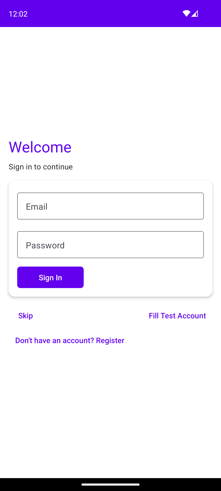
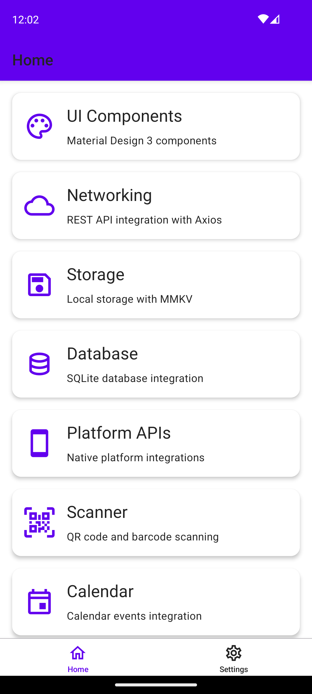
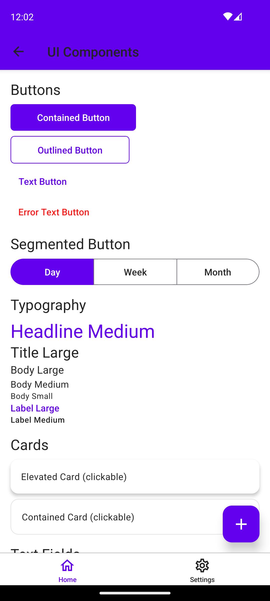
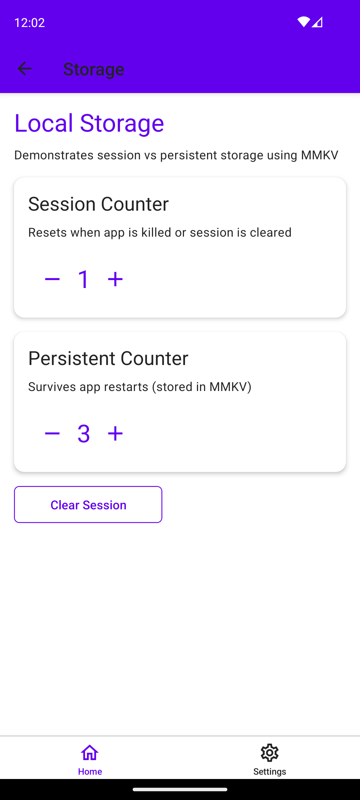
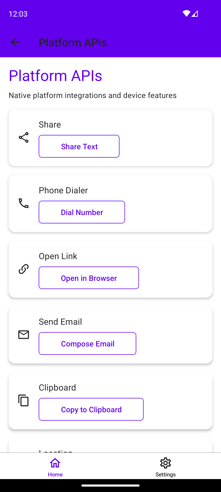
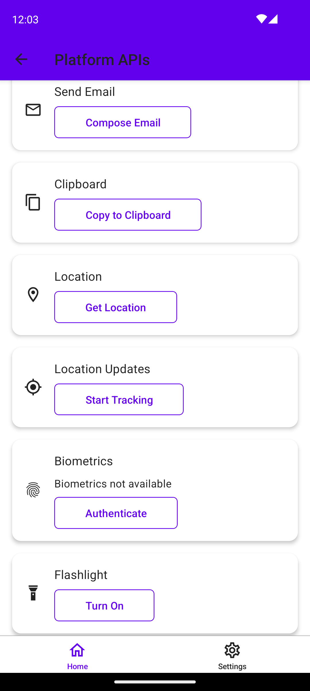
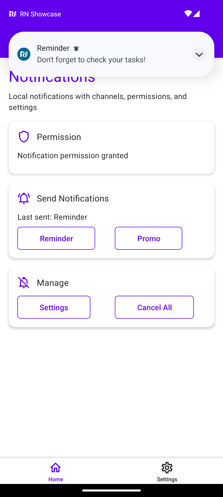
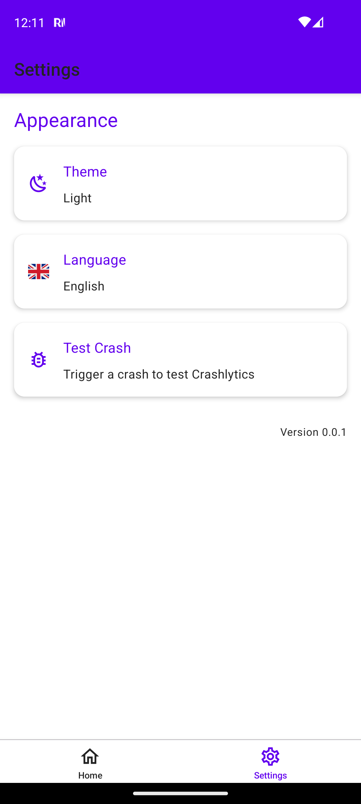

# RN Showcase

A production-ready React Native demo app showcasing modern mobile development with MVVM + Clean Architecture, TypeScript, and native platform integrations.

[](https://reactnative.dev)
[](https://www.typescriptlang.org)


**100% shared code** across Android & iOS

---

<table>
<tr>
<td style="width:50%">

### UI & Navigation
- React Navigation 6+
- Material Design 3
- Dark Mode + System Theme
- 40+ Components

</td>
<td style="width:50%">

### Platform APIs
- Biometrics (Face ID / Fingerprint)
- Camera & QR/Barcode Scanner
- Location & Permissions
- Flashlight

</td>
</tr>
<tr>
<td style="width:50%">

### Data & Network
- Axios HTTP Client
- MMKV Storage
- SQLite Database (op-sqlite)
- Clean Architecture

</td>
<td style="width:50%">

### Notifications
- Local Notifications
- Notification Channels
- Permission Handling

</td>
</tr>
</table>

---

## Screenshots

<table>
<tr>
<td></td>
<td></td>
<td></td>
<td></td>
</tr>
<tr>
<td style="text-align:center">Login</td>
<td style="text-align:center">Home</td>
<td style="text-align:center">UI Components</td>
<td style="text-align:center">Storage</td>
</tr>
<tr>
<td></td>
<td></td>
<td></td>
<td></td>
</tr>
<tr>
<td style="text-align:center">Platform APIs</td>
<td style="text-align:center">Platform APIs</td>
<td style="text-align:center">Notifications</td>
<td style="text-align:center">Settings</td>
</tr>
</table>

---

## Tech Stack


---

## Architecture

```
Presentation  →  Domain  →  Data
  (Screen/VM)    (UseCase)   (Repository)
```

---

## Quick Start

```bash
# Install dependencies
npm install

# iOS (first time)
cd ios && pod install && cd ..

# Run Android
npx react-native run-android

# Run iOS
npx react-native run-ios

# Run tests
npx jest
```

---

## Project Structure

```
src/
├── app/                    # App entry, DI setup
│   └── di/                 # Dependency injection (tsyringe)
├── presentation/           # UI Layer
│   ├── screens/            # Feature screens
│   │   └── xxx/
│   │       ├── XxxScreen.tsx
│   │       ├── useXxxViewModel.ts
│   │       └── XxxUiState.ts
│   ├── components/         # Reusable components
│   ├── navigation/         # React Navigation
│   └── foundation/         # Theme, colors, strings
├── domain/                 # Business Logic
│   ├── models/             # Domain models
│   ├── repositories/       # Repository interfaces
│   ├── useCases/           # UseCase classes
│   └── exceptions/         # Custom exceptions
└── data/                   # Data Layer
    ├── repositories/       # Repository implementations
    ├── network/            # API clients (Axios)
    ├── analytics/          # Firebase Analytics & Crashlytics
    ├── dto/                # Data Transfer Objects
    └── local/              # MMKV, SQLite
```


---

## Author

Miroslav Kusnir

## License

MIT
